# PeerPrep: System Design Diagrams

---

## **Diagram 1: User Matching Flow**

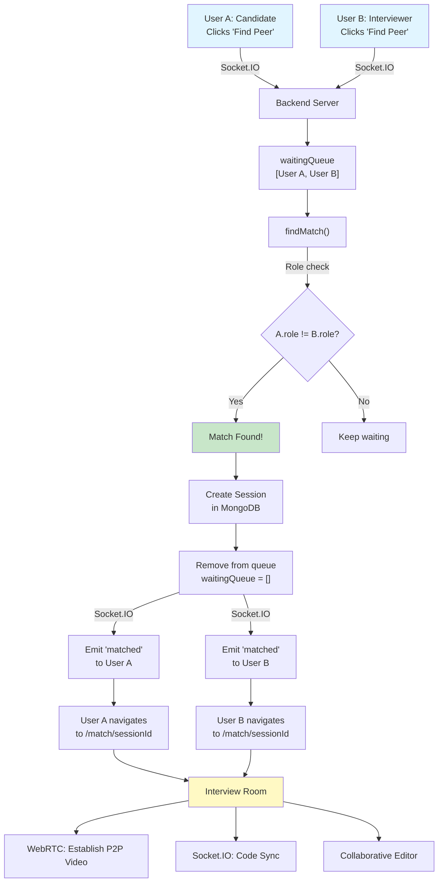

---

## **Diagram 2: Real-time Code Synchronization**

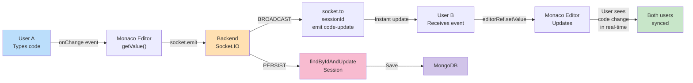

---

## **Diagram 3: Authentication & JWT Flow**

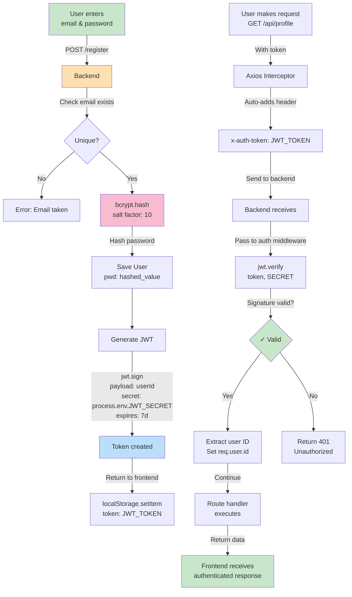

---

## **Diagram 4: WebRTC Connection Establishment**

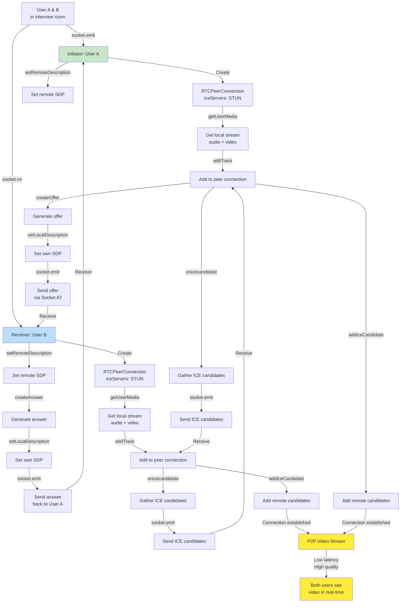

---

## **Diagram 5: Scalable Architecture - Load Balancing**

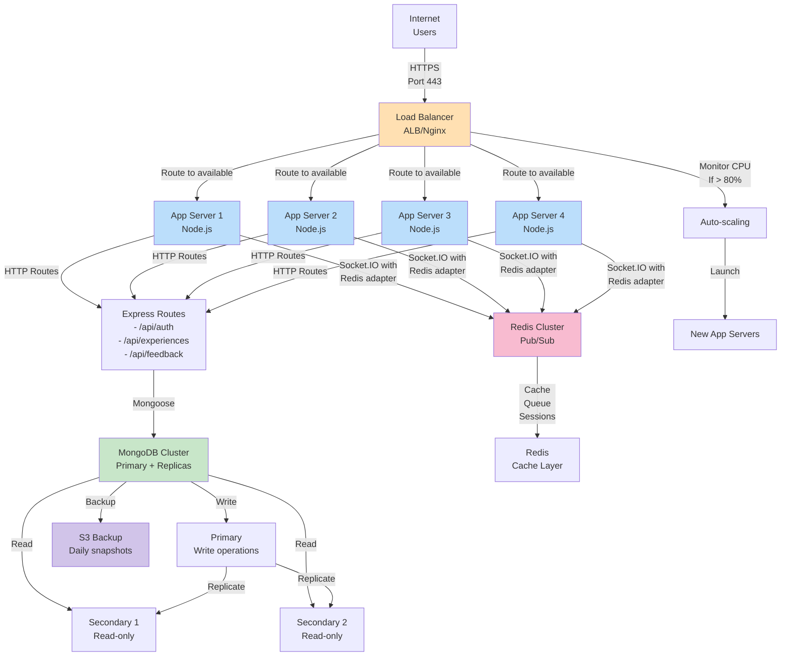

---

## **Diagram 6: Data Flow - Complete Request**

```mermaid
graph LR
    A["Frontend<br/>React Component"] -->|1. Click 'Share'| B["Form Data"]
    
    B -->|2. POST /experiences<br/>+ JWT Token| C["Axios"]
    
    C -->|3. HTTP Request| D["Load Balancer"]
    
    D -->|4. Route to Server| E["Express Server"]
    
    E -->|5. Verify JWT<br/>auth middleware| F["Extract userId"]
    
    F -->|6. Create Experience| G["Mongoose Model"]
    
    G -->|7. Save to DB| H["MongoDB"]
    
    H -->|8. Generate _id| I["Experience Created"]
    
    I -->|9. Populate user| J["Query User collection<br/>.populate"]
    
    J -->|10. Return full data| K["Response object<br/>with author details"]
    
    K -->|11. Send response| L["Frontend receives<br/>JSON"]
    
    L -->|12. Update state| M["setExperiences"]
    
    M -->|13. Re-render| N["Experience appears<br/>in list"]
    
    style A fill:#c8e6c9
    style N fill:#c8e6c9
    style H fill:#d1c4e9
    style E fill:#ffe0b2
```

---

## **Diagram 7: Feedback Rating & Aggregation**

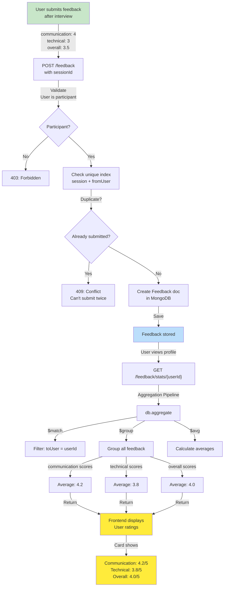

---

## **Diagram 8: Interview Experience Lifecycle**

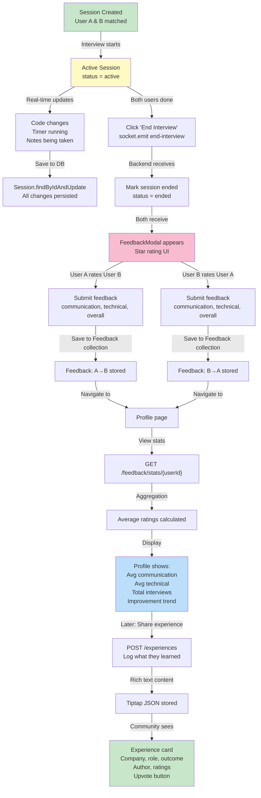

---

## **Diagram 9: Scalability Growth Path**

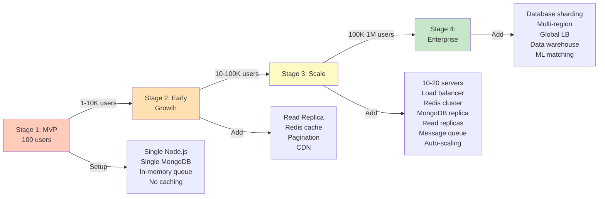

---

## **Diagram 10: Current vs Scaled Database**

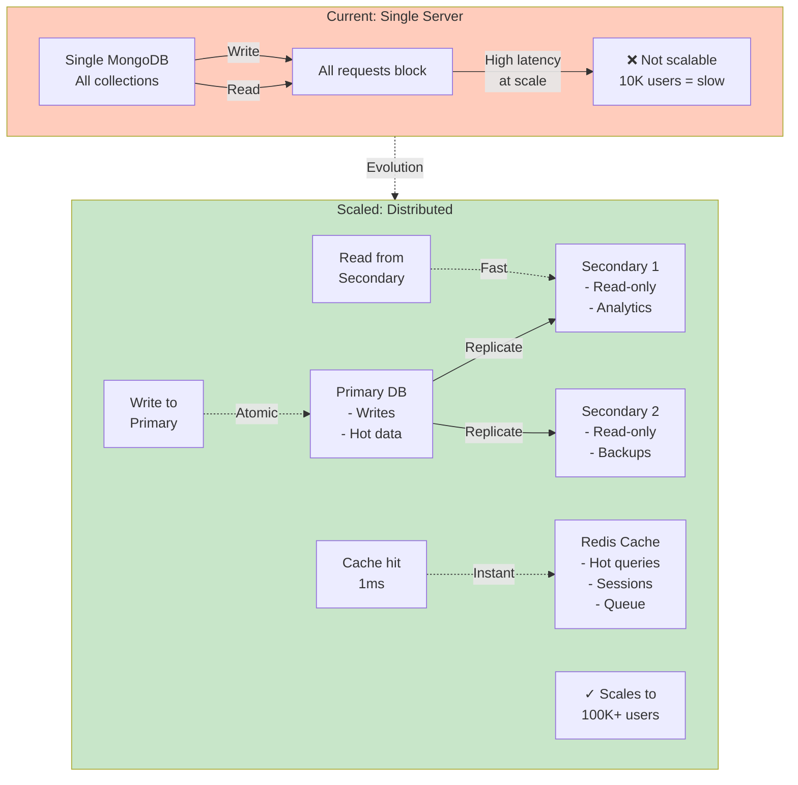

---

## **Diagram 11: Socket.IO with Redis Adapter**

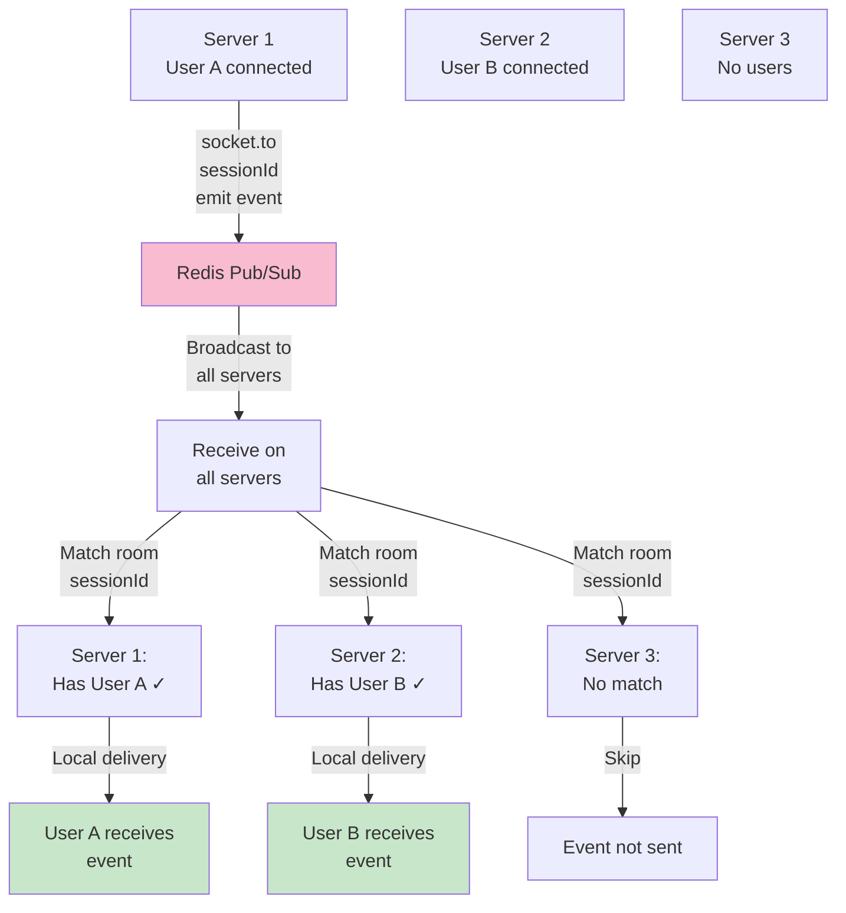

---

## **Diagram 12: Security Layers**

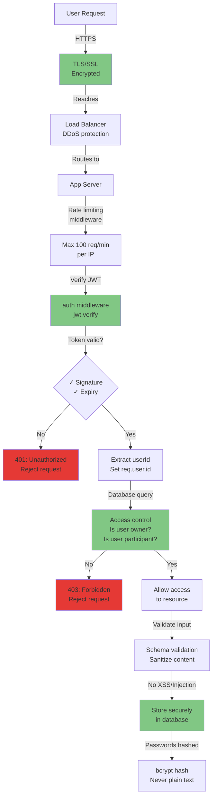

---

## **Diagram 13: Message Queue - Async Processing**

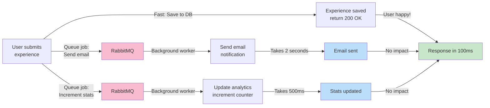

---

## **Diagram 14: Interview Experience Filters**

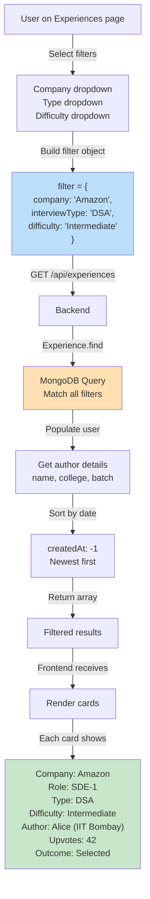

---

**Complete system design visualized with 14 comprehensive diagrams!** 🎨

Use these diagrams in:
- System design interviews 🎤
- Team documentation 📚
- Architecture reviews 👥
- Scaling discussions 📈
